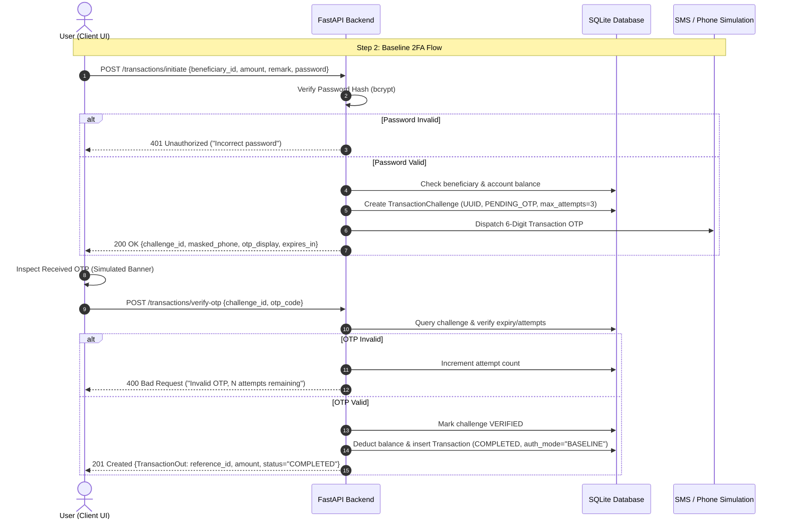

# ATAF — Step 2: Baseline Authentication (System 1)

## Overview

**Step 2** of the **Adaptive Transaction Authentication Framework (ATAF)** implements **System 1: Baseline Authentication**.

This system establishes the conventional two-factor authentication (2FA) baseline used by most modern consumer banking platforms:
$$\text{Password} \longrightarrow \text{OTP} \longrightarrow \text{Transaction}$$

### Project Domain & Responsibility
* **Domain:** Cybersecurity / Authentication
* **Responsible:** Aditya
* **Input:** Banking Application (from Step 1)
* **Goal:** Establish the conventional authentication baseline for transaction processing.
* **Output:** Working System 1 — Baseline Authentication.

---

## Threat Model & Cybersecurity Rationale

In conventional online banking systems, every transaction requires the user to authenticate using:
1. **Factor 1 (Knowledge):** Account Password / Transaction Password.
2. **Factor 2 (Possession):** 6-digit One-Time Password (OTP) delivered out-of-band to a registered device/phone.

### Vulnerabilities of Baseline 2FA
While Baseline 2FA protects against brute-force password guessing and static credential reuse, it has critical vulnerabilities under **social-engineering attacks**:
* **OTP Phishing / Vishing:** Attackers convince victims over phone calls to read aloud their received OTP code.
* **Lack of Transaction Binding:** Conventional OTP messages often fail to prominently emphasize transaction context, leading victims to enter OTPs without verifying recipient account details.
* **Adversary-in-the-Middle (AiTM):** Reverse proxies intercept both password and OTP simultaneously.

*In later steps of ATAF (Steps 10–12), this Baseline system is evaluated against real-world social-engineering attack scenarios to measure fraud success rate, false acceptances, and authentication burden.*

---

## Authentication Protocol Flow



---

## Key Backend Enhancements in Step 2

1. **Transaction Challenge Engine (`models/challenge.py`):**
   * Manages ephemeral transaction authorization sessions with UUID tokens.
   * Tracks attempt limits (max 3), TTL expiration (300 seconds), and status lifecycle (`PENDING_OTP` $\to$ `VERIFIED` / `EXPIRED` / `CANCELLED`).
2. **Password Verification Enforcement:**
   * Direct money transfers via legacy unauthenticated endpoints are disabled (`400 Bad Request`).
   * `/transactions/initiate` requires the account password before any OTP challenge is spawned.
3. **Transaction-Bound OTP:**
   * OTPs are generated specifically for transaction authorization and bound to the specific recipient, amount, and challenge ID.
4. **Audit Logging & Authentication Badges:**
   * Transactions record `auth_mode = "BASELINE"` and `auth_factors = "PASSWORD,OTP"` for forensic traceability.

---

## API Endpoints

| Method | Endpoint | Auth Required | Description |
|---|---|---|---|
| `POST` | `/transactions/initiate` | Bearer Token | Submits transfer details + password. Returns challenge ID and OTP. |
| `POST` | `/transactions/verify-otp` | Bearer Token | Submits OTP to finalize and execute the transaction. |
| `POST` | `/transactions/resend-otp` | Bearer Token | Generates a fresh OTP for an active challenge session. |
| `POST` | `/transactions/cancel` | Bearer Token | Cancels an unverified transaction challenge. |
| `GET` | `/transactions` | Bearer Token | Retrieves transaction history with 2FA audit tags. |
| `POST` | `/transactions` (Legacy) | Bearer Token | Blocked (`400 Bad Request`) to enforce 2FA pipeline. |

---

## How to Run Step 2

### 1. Start the Backend
```bash
cd Step2/backend
# Setup virtual environment if not already active:
uv venv
source .venv/bin/activate
uv pip install -r requirements.txt

# Run the server:
python run.py
```
* **API Server:** `http://127.0.0.1:8000`
* **Swagger Documentation:** `http://127.0.0.1:8000/docs`

### 2. Start the Frontend
In a new terminal:
```bash
cd Step2/frontend
npm install
npm run dev
```
* **Frontend App:** `http://localhost:5173`

---

## Testing the Baseline Authentication Flow

1. Register a test account (or login).
2. Add a beneficiary under the **Beneficiaries** tab.
3. Navigate to **Transfer**:
   * **Stage 1 (Details):** Select beneficiary, enter amount (e.g. ₹5,000), enter remark, click **Continue**.
   * **Stage 2 (Factor 1 - Password):** Review transfer preview, input your account password, click **Verify Password & Request OTP**.
   * **Stage 3 (Factor 2 - OTP):** View the simulated OTP on screen, enter the 6-digit OTP, click **Verify OTP & Execute Transfer**.
   * **Stage 4 (Completion):** Transaction executes with `COMPLETED` status, unique reference ID, and `Baseline (Password + OTP)` tag!
