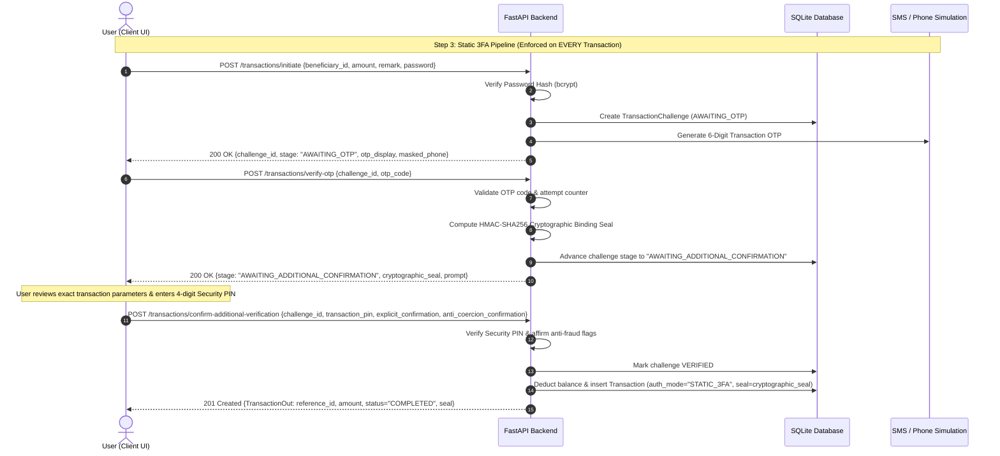

# ATAF — Step 3: Static 3FA (System 2)

## Overview

**Step 3** of the **Adaptive Transaction Authentication Framework (ATAF)** implements **System 2: Static 3-Factor Authentication (Static 3FA)**.

This system requires every transaction—regardless of value, recipient, or risk level—to undergo an additional transaction-bound confirmation step following standard password and OTP checks:
$$\text{Password} \longrightarrow \text{OTP} \longrightarrow \text{Additional Confirmation} \longrightarrow \text{Transaction}$$

### Project Domain & Responsibility
* **Domain:** Cybersecurity / Authentication
* **Responsible:** Aditya
* **Input:** Baseline Authentication (from Step 2)
* **Goal:** Create a system where additional verification is required for **every** transaction.
* **Output:** Working System 2 — Static 3FA.

---

## Cybersecurity Threat Model & Research Context

### Why Static 3FA?
Social-engineering attacks (such as bank official impersonation, urgent refund scams, or fake support calls) often succeed because victims are persuaded to share or enter OTPs without inspecting transaction parameters.

In Static 3FA, ATAF enforces a **Transaction-Bound Additional Confirmation mechanism** (referencing Step 8 in the project plan):
1. **Explicit Transaction Parameter Display:** Shows exact recipient name, masked account number, IFSC code, and transfer amount.
2. **Explicit User Affirmation:** Prompts: *"Did you personally initiate this transaction?"* and requires checking explicit anti-fraud confirmation boxes.
3. **Cryptographic Transaction Binding:** Computes a unique HMAC-SHA256 signature mathematically binding the transaction parameters:
   $$\text{Seal} = \text{HMAC-SHA256}(K_{\text{secret}}, \text{challenge\_id} \mathbin{\Vert} \text{user\_id} \mathbin{\Vert} \text{beneficiary\_account} \mathbin{\Vert} \text{amount} \mathbin{\Vert} \text{nonce})$$
4. **Knowledge Factor 3 (Security PIN):** Requires a 4-digit Transaction Security PIN (default `1234`) to execute the cryptographic sign-off.

### The Security vs. Usability Trade-Off
* **Security Benefit:** 100% of transactions are guarded by 3 distinct factors, preventing accidental or coerced one-click approvals.
* **Usability Burden:** Every single transfer—even low-value routine transfers—demands high cognitive effort and multiple verification steps.
* *In Steps 11 & 12, this Static 3FA system is compared against the Proposed Adaptive System (Step 9) to measure user friction, transaction completion time, and false alarm fatigue.*

---

## Authentication Protocol Flow



---

## API Endpoints

| Method | Endpoint | Auth Required | Description |
|---|---|---|---|
| `POST` | `/transactions/initiate` | Bearer Token | **Factor 1:** Verifies account password; returns challenge in `AWAITING_OTP` stage. |
| `POST` | `/transactions/verify-otp` | Bearer Token | **Factor 2:** Verifies OTP; computes cryptographic seal; advances to `AWAITING_ADDITIONAL_CONFIRMATION`. |
| `POST` | `/transactions/confirm-additional-verification` | Bearer Token | **Factor 3:** Enforces explicit confirmation & Security PIN; executes transaction. |
| `POST` | `/account/pin` | Bearer Token | Allows user to configure or change their 4-digit Transaction Security PIN. |
| `POST` | `/transactions/resend-otp` | Bearer Token | Resends a fresh OTP for an active challenge session. |
| `POST` | `/transactions/cancel` | Bearer Token | Cancels an active 3FA authorization challenge. |
| `GET` | `/transactions` | Bearer Token | Lists transactions with Static 3FA audit badges and cryptographic seals. |

---

## How to Run Step 3

### 1. Start the Backend
```bash
cd Step3/backend
uv venv
source .venv/bin/activate
uv pip install -r requirements.txt

# Run the server:
python run.py
```
* **API Server:** `http://127.0.0.1:8000`
* **Swagger Docs:** `http://127.0.0.1:8000/docs`

### 2. Start the Frontend
In a new terminal:
```bash
cd Step3/frontend
npm install
npm run dev
```
* **Frontend App:** `http://localhost:5173`

---

## Testing the Static 3FA Pipeline

1. Register an account (or login). Notice default Transaction Security PIN is `1234`.
2. Add a beneficiary under **Beneficiaries**.
3. Initiate a transfer under **Transfer**:
   * **Stage 1 (Details):** Choose beneficiary and transfer amount.
   * **Stage 2 (Factor 1 - Password):** Enter account password.
   * **Stage 3 (Factor 2 - OTP):** Enter the 6-digit transaction OTP from the simulated banner.
   * **Stage 4 (Factor 3 - Additional Confirmation):**
     * Review the high-security callout with exact recipient details and cryptographic seal.
     * Check: *"I explicitly verify that I personally initiated this transfer..."*
     * Check: *"I confirm that I am not following instructions from an unknown phone caller..."*
     * Enter 4-digit Security PIN (`1234`).
     * Click **Cryptographically Sign & Execute Transfer**.
   * **Stage 5 (Completion):** Transaction is finalized with audit mode `STATIC_3FA`, all 3 factors verified, and unique cryptographic verification seal!
